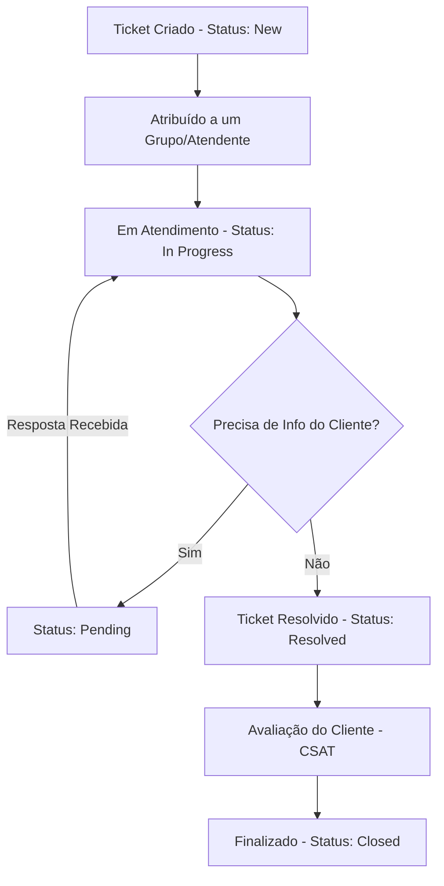

# Manual do Operador — Go Help Desk

Bem-vindo ao **Manual do Operador** do Go Help Desk. Este guia foi desenvolvido para capacitar atendentes, analistas e administradores no uso diário da plataforma, ajudando a gerenciar chamados de forma eficiente e a entregar um serviço de suporte de excelência.

---

## 1. Visão Geral do Sistema e Fluxo de Atendimento

O Go Help Desk centraliza a comunicação de suporte entre os clientes (solicitantes) e a equipe técnica/operacional. Cada chamado é tratado como um **Ticket** que passa por etapas bem definidas até sua resolução final.

### Ciclo de Vida de um Ticket

---

## 2. Acesso e Painel de Controle (Dashboard)

Ao fazer login com suas credenciais de **Staff** ou **Admin**, a primeira tela apresentada é o **Dashboard**. Ele exibe um resumo rápido da sua fila de trabalho:

- **Tickets Abertos**: Quantidade de tickets aguardando atendimento.
- **Meus Tickets**: Quantidade de tickets em que você é o atendente responsável.
- **Não Atribuídos**: Tickets aguardando um atendente ou grupo assumir.
- **Desempenho Geral**: Gráficos de volume de tickets resolvidos e tempos de resposta.

> [!TIP]
> Monitore o Dashboard ao iniciar o seu turno para identificar prioridades urgentes e chamados que não foram atribuídos a nenhum grupo.

---

## 3. Gestão e Triagem da Fila de Tickets

No menu **Tickets**, você visualiza a fila de chamados. A plataforma oferece filtros inteligentes para ajudar na organização do trabalho.

### Usando os Filtros da Fila
No topo da listagem, utilize as opções de filtragem rápida para focar no que importa:
* **Filtro por Atendente**: Visualize apenas os tickets sob sua responsabilidade (*Meus Tickets*) ou de outros colegas.
* **Filtro por Grupo**: Exiba os tickets sob tutela de um time específico (ex: `Equipe Financeira` ou `Equipe de Suporte`).
* **Filtro por Status e Prioridade**: Priorize tickets em status `New` de alta prioridade.

### Triagem com a Hierarquia CTI (Categoria, Tipo, Item)
Para que o sistema direcione o ticket ao grupo correto, o chamado precisa ser classificado adequadamente. A estrutura é dividida em 3 níveis de detalhe:

| Nível | Descrição | Exemplo 1: Suporte | Exemplo 2: Financeiro |
| :--- | :--- | :--- | :--- |
| **Categoria** | O setor principal ou área macro. | `Suporte` | `Financeiro` |
| **Tipo** | O assunto específico do problema. | `Instabilidade` / `Dificuldade de Uso` | `Mensalidade Atrasada` / `Erro no Pagamento` |
| **Item** | O detalhe operacional (opcional). | `Lentidão na pesquisa` | `Boleto vencido` |

> [!IMPORTANT]
> A correta classificação da **Categoria** e do **Tipo** garante que as regras de encaminhamento direcionem os tickets para o grupo de atendimento correto (Passo 5 do cadastro de Setores).

---

## 4. Detalhes do Ticket e Resolução

Ao abrir um ticket, você terá acesso à tela de atendimento completa. Veja como realizar as principais interações:

### Responder ao Cliente vs. Notas Internas
A caixa de texto no rodapé do ticket possui duas abas fundamentais para a comunicação:

1. **Aba Pública (Mensagem)**: 
   - Envia um e-mail diretamente ao cliente solicitante.
   - Utilizada para tirar dúvidas, instruir o usuário e notificar resoluções.
2. **Aba Interna (Nota)**:
   - Armazena observações que ficam visíveis **apenas** para o time operacional.
   - Útil para registrar análises técnicas, diagnósticos de segundo nível ou observações privadas sobre o caso.

> [!NOTE]
> As Notas Internas aparecem com um fundo destacado (geralmente amarelo ou laranja claro) na linha do tempo do ticket para evitar confusões com mensagens públicas.

### Gerenciamento de Status e Cores
Os status indicam a fase atual do ticket:

* **New (Roxo)**: Ticket acabou de ser criado e precisa de triagem.
* **In Progress (Laranja)**: O operador está atuando no problema.
* **Pending (Roxo Claro)**: O suporte aguarda um retorno ou teste do cliente. O prazo de SLA congela temporariamente neste status.
* **Resolved (Verde)**: O operador solucionou o problema. O cliente receberá um aviso e o formulário de satisfação (CSAT).
* **Closed (Cinza)**: Chamado finalizado definitivamente. Não pode ser reaberto.

### Níveis de Prioridade
Defina o nível de urgência do ticket para priorizar o atendimento:
* **Low (Baixa)**: Dúvidas gerais ou melhorias que não afetam o uso diário.
* **Medium (Média)**: Problemas com alternativas de contorno simples.
* **High (Alta)**: Funcionalidades importantes inacessíveis a um grupo de usuários.
* **Critical (Crítica)**: Sistema fora do ar para múltiplos clientes ou falha crítica de segurança.

### Respostas Rápidas (Canned Responses)
Para evitar digitação repetitiva de instruções comuns, use o recurso de **Canned Responses**:
1. Clique no botão de modelos/respostas rápidas acima da caixa de resposta.
2. Selecione a resposta desejada (ex: instruções de recuperação de senha ou confirmação de pagamento).
3. O texto será preenchido automaticamente, permitindo que você personalize o nome do cliente antes de enviar.

---

## 5. SLAs (Acordos de Nível de Serviço)

A SLA define os prazos máximos que sua equipe tem para responder e resolver os chamados.

* **SLA de Resposta (First Response Target)**: O tempo máximo para dar o primeiro retorno público ao cliente.
* **SLA de Resolução (Resolution Target)**: O tempo total tolerável desde a criação do ticket até a alteração para o status `Resolved`.

> [!WARNING]
> O estouro da SLA (*Breach*) é registrado no histórico do ticket e afeta os relatórios de qualidade apresentados aos administradores. Fique atento aos cronômetros visuais na barra lateral do ticket.

---

## 6. Base de Conhecimento (Knowledge Base - KB)

Antes de responder a uma dúvida complexa, consulte a **Base de Conhecimento** no menu lateral.
- Você pode buscar por artigos de ajuda gerais ou internos.
- Se você é um operador autorizado pelo administrador, também pode escrever e publicar novos artigos para ajudar os clientes a se autoatenderem e reduzir a carga de tickets da equipe.

---

## 7. Avaliações (CSAT) e o IA Coach

Ao marcar um ticket como `Resolved`, o cliente recebe um link para avaliar o atendimento com notas de **0 a 5 estrelas** e um comentário opcional.

### Como funciona o IA Coach (Gemini)
Nossa inteligência artificial analisa constantemente o sentimento dos comentários deixados pelos clientes:
1. **Análise de Sentimento**: A IA gera um resumo construtivo das opiniões dos clientes sobre o atendimento da equipe.
2. **Dicas Práticas de Treinamento**: Baseada nas avaliações negativas ou pontos fortes, o IA Coach sugere 3 dicas de ouro de como você ou seu time podem melhorar a postura ou os processos de suporte.
3. **Feedback via E-mail**: O administrador do sistema pode enviar as orientações personalizadas do IA Coach diretamente para o seu e-mail corporativo como um PDI (Plano de Desenvolvimento Individual).

> [!TIP]
> Encare as dicas do IA Coach como mentoria construtiva. Se a IA sugerir maior agilidade em dúvidas financeiras, busque usar Canned Responses adequadas para reduzir o tempo médio de atendimento nesses tópicos.
